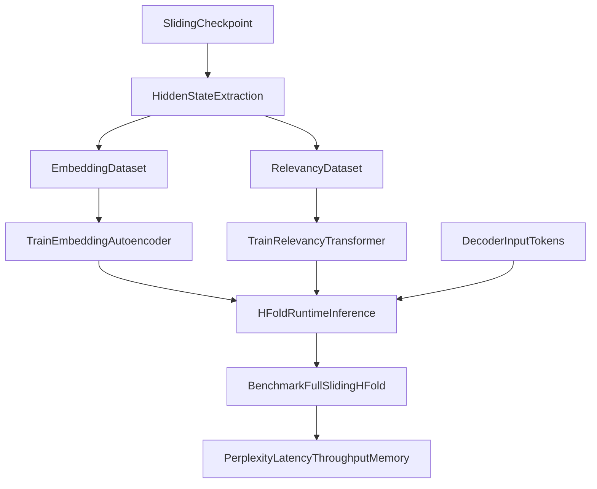

# HFold Master Implementation Plan

## Scope and Decisions

- Primary implementation target: new top-level package at `hfold/` (separate from `final_mks/Fold2`).
- Cross-model support: one shared embedding/relevancy backbone with lightweight per-backbone adapters (Pythia, GPT-2).
- HFold is inference-time only on top of already fine-tuned sliding-window checkpoints.
- Benchmarks to compare three attention modes on the same checkpoints: regular full attention, sliding window, and HFold.

## Algorithm Summary (Canonical)

### State

- Sliding window size: `W`.
- Heap capacity: `S`.
- Per-step retrieval count from heap: `K`.
- Per-step candidate insert count from current attention: `w`.
- Global heap per layer (or shared mode if explicitly configured later): max-heap entries `(score, vector, metadata)`.
- Metadata tracks token origin (batch item, sequence position, layer id, head id, timestep id).

### Timestep 0

1. Run model normally with sliding-window attention.
2. For each layer, compute top-`w` attention-scored token vectors from valid past context.
3. Push these entries into heap (bounded to size `S`, keeping highest scores).
4. Do not retrieve from heap on timestep 0.

### Timestep t > 0

1. Pop top-`K` entries from heap.
2. Append these `K` vectors to current layer input context for this timestep (effective context length increases by `K`).
3. Run attention/layers and obtain transformed outputs for:
   - the current local/sliding-window tokens, and
   - the injected heap vectors.
4. Collect reinsert candidates:
   - transformed versions of the injected `K` vectors, plus
   - top-`w` attention vectors from current step that are not duplicates of those `K`.
5. Push reinsertion candidates into heap; evictions occur if capacity `S` exceeded.
6. Gather all evicted vectors into a set `E` (size `<= S`).
7. Build one summary embedding `g` from `E` via embedding autoencoder bottleneck.
8. Retrieve all current heap vectors without popping.
9. Relevancy model outputs one scalar per heap vector: `r_i = Rel(g, h_i)`.
10. Fold update for each heap vector:
    - `h_i <- h_i + r_i * g`
11. Continue to next timestep; heap persists globally across decoding.

## Model Architecture Plan

## HFold Inference Module

- `hfold/inference/heap_state.py`
  - Typed state objects for heap entries, per-layer heap, and global HFold state.
- `hfold/inference/priority_heap.py`
  - Stable bounded max-heap implementation with deterministic tie-breaking.
- `hfold/inference/hfold_runtime.py`
  - Runtime orchestration (`step0`, `step_t`, reinsert, evict, fold).
- `hfold/inference/attention_patch.py`
  - Hooks/wrappers for GPT-NeoX (Pythia) and GPT-2 attention modules.
- `hfold/inference/vector_store.py`
  - Utility for appending retrieved vectors to attention inputs and mapping back transformed outputs.

## Embedding Model (Autoencoder Bottleneck)

- `hfold/models/embedding_autoencoder.py`
  - Input: `E` padded/truncated to fixed `S` vectors.
  - Encoder: token-wise projection + cross-token mixer + bottleneck vector `g`.
  - Decoder: reconstruct `S` vectors from `g` (+ optional positional slots).
  - Output losses:
    - cosine reconstruction loss (primary),
    - optional L2 stabilization term.
- `hfold/models/adapters.py`
  - per-backbone adapters to map hidden states into shared latent dimension and back.

## Relevancy Model

- `hfold/models/relevancy_transformer.py`
  - Encoder-only transformer over sequence `[g, h_1, ..., h_S]`.
  - Outputs scalar logits for each `h_i`.
  - Scoring head and calibration head (optional).
- Target supervision:
  - attention-derived importance labels from teacher model hidden states/attention maps.

## Data and Training Plan

## Training Data Construction

- `hfold/data/hidden_state_dataset.py`
  - Extract hidden states/attention from fine-tuned sliding-window checkpoints.
  - Build tuples:
    - evicted set `E`,
    - synthetic/true global target context,
    - heap vectors `H`,
    - teacher importance targets from attention.
- Datasets:
  - Use existing benchmark/fine-tune corpora in repo workflow (WikiText + SCROLLS variant currently used).
  - Optional augmentation with PG-19 style long-context slices if available.

## Embedding Autoencoder Training

- `hfold/training/train_embedding.py`
  - Train shared encoder/decoder in latent space.
  - Use per-backbone input adapters.
  - Validate by reconstruction cosine and downstream fold utility proxy.

## Relevancy Training

- `hfold/training/train_relevancy.py`
  - Inputs: `g` and heap vectors `H`.
  - Targets: normalized teacher attention importance.
  - Loss:
    - MSE or KL on calibrated importance distribution,
    - ranking loss (pairwise) to preserve top important vectors.

## Joint Fine-Tuning (Optional Final Stage)

- `hfold/training/train_joint_aux.py`
  - Light joint optimization of embedding + relevancy after separate pretraining.
  - Keeps adapters trainable, main shared backbones mostly frozen.

## Integration With Existing Fine-Tuning / Benchmark Flow

- Add integration wrappers (new files, no destructive rewrite initially):
  - `hfold/integration/pythia_runner.py`
  - `hfold/integration/gpt2_runner.py`
  - `hfold/integration/benchmark_runner.py`
- Wire to existing scripts:
  - `fine_tune.py` and `new_fine_tune.py` remain source of checkpoint production.
  - New scripts consume their output checkpoints and run:
    1. full-attention eval,
    2. sliding-window eval,
    3. HFold eval.
- CLI scripts:
  - `hfold/scripts/run_hfold_inference.py`
  - `hfold/scripts/train_embedding_model.py`
  - `hfold/scripts/train_relevancy_model.py`
  - `hfold/scripts/benchmark_all_modes.py`

## Proposed Project Layout

```text
hfold/
  __init__.py
  config/
    schema.py
  inference/
    heap_state.py
    priority_heap.py
    vector_store.py
    attention_patch.py
    hfold_runtime.py
  models/
    adapters.py
    embedding_autoencoder.py
    relevancy_transformer.py
  data/
    hidden_state_dataset.py
    collate.py
  training/
    train_embedding.py
    train_relevancy.py
    train_joint_aux.py
    losses.py
    metrics.py
  integration/
    pythia_runner.py
    gpt2_runner.py
    benchmark_runner.py
  scripts/
    train_embedding_model.py
    train_relevancy_model.py
    run_hfold_inference.py
    benchmark_all_modes.py
tests/
  test_heap.py
  test_hfold_runtime.py
  test_embedding_autoencoder.py
  test_relevancy_model.py
  test_attention_patch_pythia.py
  test_attention_patch_gpt2.py
  test_integration_benchmarks.py
  test_determinism.py
```

## End-to-End Flow Diagram



## Comprehensive Testing Strategy

## Unit Tests

- Heap correctness:
  - ordering, bounded size, deterministic ties, pop/reinsert invariants.
- Runtime step logic:
  - timestep 0 no retrieval,
  - timestep > 0 retrieval+append+reinsert behavior,
  - evicted set creation and padding behavior.
- Folding math:
  - `h_i + r_i * g` exactness under controlled inputs.
- Model shape tests:
  - embedding autoencoder I/O, bottleneck vector shape,
  - relevancy outputs exactly `|S|` scores.

## Property Tests

- Causality (no future leakage).
- Heap size invariant (`<= S`) across long random traces.
- Numerical stability under fp32/bf16.

## Integration Tests

- Pythia and GPT-2 attention patch smoke tests.
- End-to-end single-batch decode with HFold enabled.
- Baseline parity tests:
  - `K=0` behaves like sliding-window baseline.
  - `S=0` disables heap path cleanly.

## Regression and Benchmark Tests

- Compare:
  - full vs sliding vs HFold on same checkpoint and dataset split.
- Validate metrics emitted:
  - loss/perplexity,
  - tokens/sec,
  - memory usage.
- Determinism test with fixed seeds.

## Implementation Phases

1. Build core heap/runtime engine + deterministic tests.
2. Implement embedding autoencoder + adapter stack + training pipeline.
3. Implement relevancy model + supervision extraction pipeline + training.
4. Integrate HFold inference wrappers for Pythia and GPT-2.
5. Add benchmark runner for all three attention modes.
6. Expand test suite to unit/property/integration/regression coverage.
7. Run validation matrix and produce reproducible benchmark report artifacts.

## Acceptance Criteria

- HFold runtime exactly follows the timestep algorithm above.
- Embedding model reconstructs evicted vectors with strong cosine similarity and produces stable bottleneck vectors.
- Relevancy model predicts meaningful scores aligned with teacher attention targets.
- Benchmarks produce full/sliding/HFold comparison for both backbones on configured datasets.
- Test suite covers all critical invariants and passes reliably.

